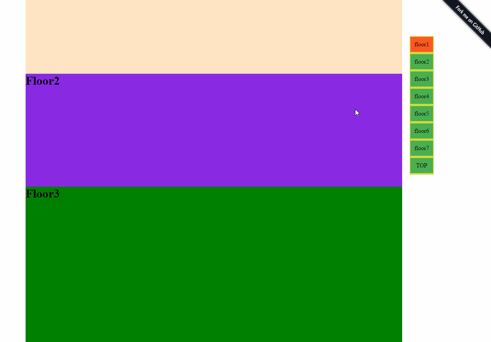

# iElevator.js
[](https://badge.fury.io/js/ielevator)
[](https://badge.fury.io/bo/ielevator)
[](https://badge.fury.io/gh/zhansingsong%2FiElevator.js)

this is a jQuery plugin for elevator, lightweight, easy to use and with some extra features

## install
`npm install ielevator` or `bower install ielevator`
## Features
- **UMD** support(AMD, CMD, Globals)
- Flexible HTML structure
- Provide several method of configuration
- Compatible with **IE6+**, **Chrome**, **Firefox**, **Safari**
- Extra functions

## Dependencies
this is a **jQuery** plugin, So jQuery is required,

### configuration
In order to ensure the plugin work normally, you provide at least one of `“backtop”` , `"floors + btns"` or `"floors + btns + backtop"`
### Default Options
```javascript
    
_defaults = {
    floors: null,
    btns: null,
    backtop: null,
    selected: '',
    sticky: -1,
    visible: {
        isHide: 'no',
        numShow: 0
    },
    speed: 400,
    show: function(me) {
        me.element.show();
    },
    hide: function(me) {
        me.element.hide();
    }
}
```
##### 'floors' option
- (selector)select all elements with the given class, each represents a floor module. the default is null.
```javascript
	$('#elevator').({
  	 floors: $('js-floor')
    });
```

##### 'btns' option
- (selector)select all elements with the given class, each represents a focus button. the default is null.
```javascript
	$('#elevator').({
  	 btns: $('js-btn')
    });
```

##### 'backtop' option
- (selector)select all elements with the given class, each represents back-to-top button. the default is null.
```javascript
	$('#elevator').({
  	 backtop: $('js-backtop')
    });
```

##### 'selected' option
- (css)selected refers to style of **[btns option]** selected or hover, or (selector) represents simulate selected object
```javascript
	$('#elevator').({
		selected: ''
        // selected: $('hightlight')
    });
```

##### 'sticky' option
- (number)sticky emulates `'sticky position'`, is a Number type(the default is -1) and represents margin from top of elevator to top of viewport . 
```javascript
    $('#elevator').({
       sticky: 100
    });
```
##### 'visible' option
- control **elevator** visibility, and contain isHide, numShow properties
- isHide: `yes`|`no`. 
if yes, elevator is visible on initialization, and vice versa. ++***NOTE:*** if no,however set any value to numShow, numShow doesn't make sense.++
- numShow:`Number`. 
when scrollTop is greater than number, elevator will be visible. and vice versa
```javascript
	$('#elevator').({
      visible: {isHide: 'no', numShow: 0}
    });
```

##### 'speed' option
- control the speed of slider bar of window
```javascript
	$('#elevator').({
 		speed: 400
    });
```

##### 'show' option
- override show function
```javascript
    show: function (me) {
    	me.element.show();
    },
```

##### 'hide' option
- override hide function
```javascript
hide: function (me) {
  me.element.hide();
}
```

## Usage
it is easy to use, only you ovrride default options to meet your requirements what you want. the following four examples to illustrate the plugin how to use.
#### 1. back to top【**[example](http://zhansingsong.github.io/back2top)**】
HTML structure:
```javascript
    <div class="elevator elevator-backtop" id="backtop" >
        <a href="javascript:;" class="js-backtop">TOP</a>
    </div>
```
Javascript:
```javascript
    $('#backtop').ielevator({
        backtop: $('#backtop .js-backtop')
    });
```
the example is very easy, only to get the "back to top" reference, and then [back to top] works

#### 2. simulate elelvator【**[example](http://zhansingsong.github.io/iElevator)**】
HTML structure:  

```javascript
    <div class="elevator" id="elevator" data-elevator-options='{"selected": "custome-selected"}'>
        <ul>
            <li><a href="javascript:;" class="custome-selected js-btn">floor1</a></li>
            <li><a href="javascript:;" class="js-btn">floor2</a></li>
            <li><a href="javascript:;" class="js-btn">floor3</a></li>
            <li><a href="javascript:;" class="js-btn">floor4</a></li>
            <li><a href="javascript:;" class="js-btn">floor5</a></li>
            <li><a href="javascript:;" class="js-btn">floor6</a></li>
            <li><a href="javascript:;" class="js-btn">floor7</a></li>
        </ul>
    </div>
```
Javascript:
```javascript
    $('#elevator').ielevator({
        floors: $('.js-floor'),
        btns: $('#elevator .js-btn'),
        selected: 'selected',
        visible: {isHide: 'yes', numShow: 400},
        show: function() {
            $('#elevator').slideDown(400);
        },
        hide: function() {
            $('#elevator').slideUp(400);
        }
    });
```
##### <font color=#d22> NOTE: **`data-ielevator-options='{"selected": "custome-selected"}'`** is the highest priority. therefore, `'custome-selected'` will overwrite `'selected' in configuration object` </font>
#### 3. simulate elevator + back to top【**[example](http://zhansingsong.github.io/iElevator-back2top)**】
HTML structure:
```javascript
    <div class="elevator" id="elevator" data-elevator-options=''>
        <ul>
            <li><a href="javascript:;" class="custome-selected js-btn">floor1</a></li>
            <li><a href="javascript:;" class="js-btn">floor2</a></li>
            <li><a href="javascript:;" class="js-btn">floor3</a></li>
            <li><a href="javascript:;" class="js-btn">floor4</a></li>
            <li><a href="javascript:;" class="js-btn">floor5</a></li>
            <li><a href="javascript:;" class="js-btn">floor6</a></li>
            <li><a href="javascript:;" class="js-btn">floor7</a></li>
            <li><a href="javascript:;" class="js-backtop">TOP</a></li>
        </ul>
    </div>
```
Javascript:
```javascript
    $('#elevator').ielevator({
        floors: $('.js-floor'),
        btns: $('#elevator .js-btn'),
        backtop: $('#elevator .js-backtop'),
        selected: 'selected',
        visible: {isHide: 'yes', numShow: 400},
        show: function() {
            $('#elevator').slideDown(400);
        },
        hide: function() {
            $('#elevator').slideUp(400);
        }
    });
```
#### 4. require.js example【[demoAMD](http://zhansingsong.github.io/demoAMD)】

#### 5. 模拟segmentfault文章导航【**[example](http://zhansingsong.github.io/segmentfault)**】
Javascript:
```javascript
    // 获取Markdown中的标题
    var $demo = $('#demo'),
        $titles = $('h2'),
        $nav = $demo.find('.list'),
        $highlight = $demo.find('.highlight'),
        STR = '';
    // 填充标题
    $titles.each(function(){
        STR += '<li><a>'+ $(this).text() +'</a></li>';
    });
    $nav.html(STR);
    // 调用ielevator
    $demo.ielevator({
        floors: $titles,
        btns: $('#demo li'),
        sticky: 10,
        selected: $highlight
    });
```

* * * *
## 中文
#####[iElevator.js](https://github.com/zhansingsong/iElevator.js)是一个jquery小插件，使用简单，兼容IE6，支持UMD和3种配置方式，比锚点更灵活。
* * *
#####Default Options
```javascript
_defaults = {
    floors: null,
    btns: null,
    backtop: null,
    selected: '',
    sticky: -1,
    visible: {isHide: 'no', numShow: 0},
    speed: 400,
    show: function (me) {
        me.element.show();
    },
    hide: function (me) {
        me.element.hide();
    }
  }
```
- `floors`:用于获取页面中对于floor模块的引用
- `btns`: 获取焦点图引用
- `backtop`: 获取回到顶部按钮的引用
- `selected`: 当焦点图在进行滚动或单击时，表示选中的样式或模拟选中的元素
- `sticky`: 模拟`position: sticky`定位，并可以指定elevator顶部距离窗口顶部的距离，默认为-1
- `visible`: 用于控制【电梯】是显示与隐藏，当srollTop值大于`numShow`是就显示，小于就隐藏
- `speed`: 控制滑条的滚动速度
- `show`: 可以重新该函数，来定制`elevator`的显示方式
- `hide`: 可以重新该函数，来定制`elevator`的隐藏方式

## 安装
`npm install ielevator` or `bower install ielevator`


## License
iElevator.js is covered by the **MIT** License.
